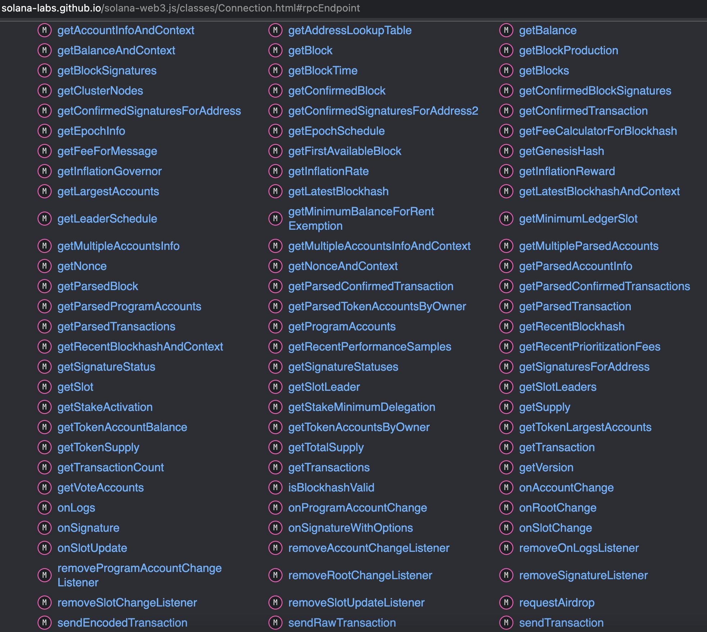

# Web3.js

如果之前接触过ETH，一定知道ETH的[web3.js](https://github.com/ethereum/web3.js/) ，主要提供了通过JavaScript与ETH上合约进行交互。而Solana也提供了与Solana的JSON RPC接口交互的[solana-web3.js](https://github.com/solana-labs/solana-web3.js) 。通过这个库，可以实现在dapp中用JavaScritp和Solana上的智能合约进行交互。

Web3.js库主要分为三部分

* RPC访问
* keypair管理
* 交易发送

## Demo
首先来看一个Demo，在Demo中，首先导入私钥，然后可以查询该账号的余额。然后执行转账，转账后再可以
查询余额来进行结果判断。

这里我们是以测试网为开发环境，所以相应的数据都在测试网上。

## 安装
solana/web3.js提供了npm包和yarn包的选择，使用yarn的话，可以在工程中用

    yarn add @solana/web3.js

进行引用，如果使用的npm的话，使用：

    npm install --save @solana/web3.js

如果想在自己已有的没有使用包管理的项目中使用，可以先checkout 出solana/web3.js的代码，然后checkout到最新的分支上，执行：

    cd your_solana_web3js_directory
    git clone https://github.com/solana-labs/solana-web3.js.git 
    git checkout v1.78.0
    yarn install
    yarn build

从lib目录取出index.iife.js既为浏览器使用的版本,然后使用`<scritp />`进行引用。

或者用已经编译好的：

    <!-- Production (minified) -->
    
## Connection
Web3.js通过Connection来抽象一个RPC链接。通过

    let url =  'https://api.testnet.solana.com';
    rpcConnection = new Connection(url);

通过指定RPC的地址这样来创建。这个对象包含了所有的RPC方法：

可以查看每个方法的文档，来查看使用方法。这里举几个简单的例子。
比如获取当前区块高度。

    let latestBlockhash = await this.connection.getLatestBlockhash('finalized');
    console.log("   ✅ - Fetched latest blockhash. Last Valid Height:", latestBlockhash.lastValidBlockHeight);

这里指定了区块状态为finalized,在console中可以看到：

    ✅ - Fetched latest blockhash. Last Valid Height: 175332530

## 账号
早年版本(20年)，Web3.js提供了一个Account对象，但是后来将其抽象为一个Keypair对象。

keypair在前面的章节中有介绍到。其本质就是一个私钥和公钥的组合。因此keypair可以用一段私钥
来进行初始化：

    constructor(keypair?: Ed25519Keypair)

可以通过构造函数，直接创建。或者通过

    static fromSecretKey(secretKey: Uint8Array, options?: { skipValidation?: boolean; })

来创建。

在前面的章节中，通过命令行创建了私钥，在文件"~/.config/solana/id.json"中，没有加密的情况下可以直接取出来

    let secretKey = Uint8Array.from(JSON.parse('[24,234,181,105,55,101,210,169,238,138,129,87,50,148,23,74,192,1,74,117,219,6,106,240,24,23,248,44,169,184,8,126,71,154,125,239,127,124,61,189,246,74,90,185,15,0,192,59,188,164,102,247,16,212,26,91,167,104,174,116,77,114,231,119]'));
    const keypair = Keypair.fromSecretKey(secretKey);
    console.log("address:", keypair.publicKey.toString())

可以看到：

    address: 5pWae6RxD3zrYzBmPTMYo1LZ5vef3vfWH6iV3s8n6ZRG

和我们命令行中的地址是一样的。

这里publicKey就是对应的账号地址，keypair就是Signer。
## 发送交易
在介绍Solana核心概念的时候，我们有介绍到Instruction和Transaction以及Message。
所以发送交易，就是构建Instructions数组，然后构造Message，再放到Transaction里面，
做签名并进行发送。

如果是普通应用合约，需要自己封装Instruction。

    /**
    * Transaction Instruction class
    */
    export class TransactionInstruction {
        /**
        * Public keys to include in this transaction
        * Boolean represents whether this pubkey needs to sign the transaction
        */
        keys: Array<AccountMeta>;
        /**
        * Program Id to execute
        */
        programId: PublicKey;
        /**
        * Program input
        */
        data: Buffer;
        constructor(opts: TransactionInstructionCtorFields);
    }

其中programId表示调用合约的地址。key是合约中需要使用到的Account， data则是所有的输入序列化后的二进制。

因为合约的入口是：

    declare_process_instruction!(
        process_instruction,
        DEFAULT_COMPUTE_UNITS,
        |invoke_context| {
            let transaction_context = &invoke_context.transaction_context;
            let instruction_context = transaction_context.get_current_instruction_context()?;
            let instruction_data = instruction_context.get_instruction_data();
            let instruction = limited_deserialize(instruction_data)?;

可以简化为：

    fn process_instruction(
        program_id: &Pubkey,
        accounts: &[AccountInfo],
        instruction_data: &[u8],
    ) -> ProgramResult {

具体的方法是从data里面解析出来，然后再解析出来参数。

而Solana的系统合约，或者说Native Program。
Web3.js已经为我们封装好了一些Instruction。
比如转账：

      SystemProgram.transfer({
        fromPubkey:new PublicKey(this.state.publicKey), //this.publicKey,
        toPubkey: new PublicKey(this.state.toPublicKey),//destination,
        lamports: this.state.toCount,//amount,
      })

这里表示从fromPubkey地址转lamports的SOL到toPubkey的地址。他实际上会调用"11111111111111111111111111111111"合约的 `transfer`方法。该方法接受三个参数，其中fromPubkey
需要是签名对象。

    fn transfer(
        from_account_index: IndexOfAccount,
        to_account_index: IndexOfAccount,
        lamports: u64,
        invoke_context: &InvokeContext,
        transaction_context: &TransactionContext,
        instruction_context: &InstructionContext,
    ) -> Result<(), InstructionError> {

因为转账只需要用到一个Instruction，所以用这个Instrcuton构造Message:

    const messageV0 = new TransactionMessage({
      payerKey: this.keypair.publicKey,
      recentBlockhash: latestBlockhash.blockhash,
      instructions: txInstructions
    }).compileToV0Message();

这里instructions是 `Array<TransactionInstruction>`一个数组。

payerKey则是发送这个消息的gas付费者，其也需要提供签名。
recentBlockhash 通过我们前面的RPC可以获取到。这里recentBlockhash不能隔的太远。这样就限制了
消息的签名时间。
最后调用compileToV0Message构造Message对象。

有了Message，还有构造 VersionedTransaction， 早期的Transaction已经废弃。

    export class VersionedTransaction {
        signatures: Array<Uint8Array>;
        message: VersionedMessage;
        get version(): TransactionVersion;
        constructor(message: VersionedMessage, signatures?: Array<Uint8Array>);
        serialize(): Uint8Array;
        static deserialize(serializedTransaction: Uint8Array): VersionedTransaction;
        sign(signers: Array<Signer>): void;
        addSignature(publicKey: PublicKey, signature: Uint8Array): void;
    }

新的VersionedTransaction
对象，通过传入 VersionedMessage 来构造：

    constructor(message: VersionedMessage, signatures?: Array<Uint8Array>);

这里我们上面构造的V0就是VersionedMessage的对象。

这里可以传入signatures,比如通过硬件钱包签名的内容。或者不传入也可以，调用：

     sign(signers: Array<Signer>): void;

传入我们上面的keypair。也可以对 VersionedTransaction进行签名。

构造结束后，通过connection的sendTransaction 方法发送即可：

        sendTransaction(transaction: VersionedTransaction, options?: SendOptions): Promise<TransactionSignature>;

这里返回的TransactionSignature即为，交易的hash，可以通过浏览器进行查询。