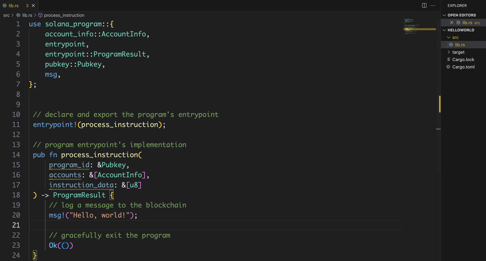

## 安装本地开发环境
在前面的文章中，我们已经安装好了solana cli。并且配置了RPC环境为测试网节点。
同时还有我们的开发账号，并且申请了水龙头空投。

    solana --version
    solana-cli 1.13.7 (src:88aeaa82; feat:1775889670)

    solana config get
    Config File: /Users/you/.config/solana/cli/config.yml
    RPC URL: https://api.devnet.solana.com 
    WebSocket URL: wss://api.testnet.solana.com/ (computed)
    Keypair Path: /Users/you/.config/solana/id.json 
    Commitment: confirmed 

在很多文章中，会推荐用户自己去搭建一个local节点。我们实践下来的话，如果不是有节点开发需求，
或者查看节点上的一些特殊日志。还是不要自己搭节点。而是直接使用测试网。

首先测试网是由水龙头的，可以得到免费代币。其次测试网的数据是有保存的，类似一些系统合约，经典
合约都有部署，可以直接进行交互使用。

接着我们需要安装rust开发环境：

    curl --proto '=https' --tlsv1.2 -sSf https://sh.rustup.rs | sh

这里需要科学上网，大家设置好代理。
安装好了之后，查看下cargo 的版本：

    cargo --version
    cargo 1.69.0 (6e9a83356 2023-04-12)

表示安装完成。

### 创建工程

选择好你的开发目录，比如demo，然后执行：

    cargo init helloworld --lib
    cd helloworld

通过以下命令，安装solana的合约依赖库：

    cargo add solana-program

此时我们看到我们的目录如下：

    .
    ├── Cargo.lock
    ├── Cargo.toml
    ├── src
    │   └── lib.rs

接着我们用熟悉的编辑器打开工程，比如Vim、Emacs。这里比较推荐用VS Code,在VSCode中安装
rust-analyzer插件，即可完美的支持Rust开发。

编辑src/lib.rs文件

    use solana_program::{
        account_info::AccountInfo,
        entrypoint,
        entrypoint::ProgramResult,
        pubkey::Pubkey,
        msg,
    };

首先导入要使用到的库。

然后通过entrypoint宏来声明合约的入口函数，也就是Instruction会调入到的函数。

    // declare and export the program's entrypoint
    entrypoint!(process_instruction);

    // program entrypoint's implementation
    pub fn process_instruction(
        program_id: &Pubkey,
        accounts: &[AccountInfo],
        instruction_data: &[u8]
    ) -> ProgramResult {
        // log a message to the blockchain
        msg!("Hello, world!");

        // gracefully exit the program
        Ok(())
    }

这个结构是固定，以至于我们可以把他放在一个单独的文件entrypoint.rs中。然后再在lib.rs中通过

    mod entrypoint;

来导入。当然这里为了方便。我们把内容全部放在lib.rs中。

### 构建合约

在当前工程的目录下。打开命令行。执行：

    cargo build-bpf

即可完成对合约的构建。

### 发布合约

发布合约，可以通过solana cli工具。

在上面构建完后，会在target目录下保存编译好的合约文件./target/deploy/hello_world.so。
这里执行：

    solana program deploy ./target/deploy/hello_world.so

即可完成合约部署。

来看浏览器中的显示：

可以看到部署合约的过程。

### 调试合约

我们这个合约的主要作用，就是将参数在交易执行过程中log出来。

因此，我们可以在我们前面的合约交互的demo，修改下Instruction，即可完成对合约的调用。

