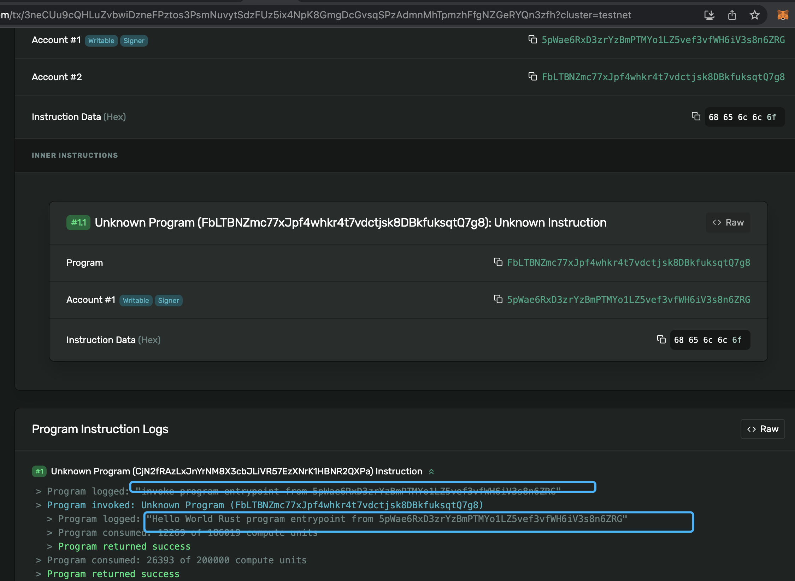

# 合约间调用
Solana 运行时允许程序通过称为跨程序调用的机制相互调用。 程序之间的调用是通过一个程序调用另一个程序的指令来实现的。 调用程序将暂停，直到被调用程序完成对指令的处理。

还是以ATA账号来举例子。比如我们创建了代币TokenA，这个时候我们要给某个人发放空投。那么根据我们前面的
经验知道，处理方式是这样的，首先我们要为这个用户创建其对应的TokenA的ATA账号，比如叫 TokenA_ATA_Account。
然后再给这个地址做mint操作。

那么我们首先按照前面文章的步骤，创建一个TokenA_ATA_Account地址，并将其ower_pubkey为该用户的交易。然后还要再创建一个给TokenA_ATA_Account mint TokenA代币的交易。

这里的两个交易有先后顺序关系，且第二个交易需要等待第一个交易执行完成，同时两次交易的gas费用也会更高。那么有没
什么办法将两次交易进行合并呢？

答案就是用一个合约来实现这两个步骤，然后发送一个交易即可。在这个合约里面，实现对账号的创建，以及对SPL-Token
的mint两个动作。这个合约需要跟ATA合约交互，调用ATA的创建账号指令，之后再和Token合约交互，执行其mint的指令。

合约之间调用分成两类，一类是不需要校验签名的`invoke`,另一类是目标合约需要校验操作权限的`invoke_signed`
方法，前者类似router 路由到另外一个合约执行，后者则目标程序对相关的账号有操作权限，也就是我们前面说的PDA账号。

## invoke路由合约

如果目标合约对输入的所有Account无需做签名校验，这种场景我们可以使用invoke来直接调用目标合约。
比如我们在最前面的"hello wolrd"程序中，只是打印了一段日志，并没有需要对输入的Account签名。

这里我们再实现一个invoke合约：

    use solana_program::{
        account_info::{AccountInfo, next_account_info},
        entrypoint,
        entrypoint::ProgramResult,
        pubkey::Pubkey,
        instruction,
        msg, program::invoke,
    };

    // Declare and export the program's entrypoint
    entrypoint!(process_instruction);

    // Program entrypoint's implementation
    pub fn process_instruction(
        _program_id: &Pubkey, // Public key of the account the hello world program was loaded into
        accounts: &[AccountInfo], // The account to say hello to
        _instruction_data: &[u8], // Ignored, all helloworld instructions are hellos
    ) -> ProgramResult {

        // Iterating accounts is safer than indexing
        let accounts_iter = &mut accounts.iter();

        // Get the account to say hello to
        let account = next_account_info(accounts_iter)?;
        let helloworld = next_account_info(accounts_iter)?;

        msg!("invoke program entrypoint from {}", account.key);

        let account_metas = vec![
            instruction::AccountMeta::new(*account.key, true),
        ];

        let instruction = instruction::Instruction::new_with_bytes(
            *helloworld.key,
            "hello".as_bytes(),
            account_metas,
        );

        let account_infos = [
            account.clone(),
        ];

        invoke(&instruction, &account_infos[..])
    }

这里，从输入中得到两个Account，第一个是调用第二个的参数，第二个是helloworld的合约的地址。

然后构造一个instruction::Instruction。最后再调用上面说的`invoke`，这里指令中的数组和invoke
里面的数组是不一样的。指令中是：

    #[repr(C)]
    #[derive(Debug, Default, PartialEq, Eq, Clone, Serialize, Deserialize)]
    pub struct AccountMeta {
        /// An account's public key.
        pub pubkey: Pubkey,
        /// True if an `Instruction` requires a `Transaction` signature matching `pubkey`.
        pub is_signer: bool,
        /// True if the account data or metadata may be mutated during program execution.
        pub is_writable: bool,
    }

而invoke里面是系统的Account：

    /// Account information
    #[derive(Clone)]
    #[repr(C)]
    pub struct AccountInfo<'a> {
        /// Public key of the account
        pub key: &'a Pubkey,
        /// The lamports in the account.  Modifiable by programs.
        pub lamports: Rc<RefCell<&'a mut u64>>,
        /// The data held in this account.  Modifiable by programs.
        pub data: Rc<RefCell<&'a mut [u8]>>,
        /// Program that owns this account
        pub owner: &'a Pubkey,
        /// The epoch at which this account will next owe rent
        pub rent_epoch: Epoch,
        /// Was the transaction signed by this account's public key?
        pub is_signer: bool,
        /// Is the account writable?
        pub is_writable: bool,
        /// This account's data contains a loaded program (and is now read-only)
        pub executable: bool,
    }

然后我们，继续实现一个客户端的调用：

    use std::str::FromStr;

    use solana_sdk::signature::Signer;
    use solana_rpc_client::rpc_client;
    use solana_sdk::signer::keypair;
    use solana_sdk::transaction;
    use solana_program::instruction;
    use solana_program::pubkey;

    const RPC_ADDR: &str = "https://api.testnet.solana.com";

    fn main() {
        let helloworld = pubkey::Pubkey::from_str("FbLTBNZmc77xJpf4whkr4t7vdctjsk8DBkfuksqtQ7g8").unwrap();
        let invoke= pubkey::Pubkey::from_str("CjN2fRAzLxJnYrNM8X3cbJLiVR57EzXNrK1HBNR2QXPa").unwrap();
        
        let me = keypair::Keypair::from_base58_string("VtqQi7BBnvnkkBefXigNdSwjywsTj2JNSFT82sNtQ3qcmcQ96SnLqtsmK44eCsVqgEX2YBMTmcvov3YfA2z7xs8");
        println!("me is {}", me.pubkey());

        let client = rpc_client::RpcClient::new(RPC_ADDR);

        let account_metas = vec![
            instruction::AccountMeta::new(me.pubkey(), true),
            instruction::AccountMeta::new_readonly(helloworld, false),
        ];

        let instruction = instruction::Instruction::new_with_bytes(
            invoke,
            "hello".as_bytes(),
            account_metas,
        );
        let ixs = vec![instruction];

        let latest_blockhash = client.get_latest_blockhash().unwrap();
        let sig = client.send_and_confirm_transaction(&transaction::Transaction::new_signed_with_payer(
            &ixs,
            Some(&me.pubkey()),
            &[&me],
            latest_blockhash,
        )).unwrap();

        println!("tx:{}", sig);
    }

和前面的调用一样，主要传递了两个AccountMeta。构建执行：

    cargo run
    Compiling cli v0.1.0 (./Solana-Asia-Summer-2023/s101/Solana-Program-Part2/demo/invoke/cli)
        Finished dev [unoptimized + debuginfo] target(s) in 2.48s
        Running `target/debug/cli`
    me is 5pWae6RxD3zrYzBmPTMYo1LZ5vef3vfWH6iV3s8n6ZRG
    tx:3neCUu9cQHLuZvbwiDzneFPztos3PsmNuvytSdzFUz5ix4NpK8GmgDcGvsqSPzAdmnMhTpmzhFfgNZGeRYQn3zfh

产看这个交易的浏览器:

这里可以很明显的看到 "inner instruction"。以及对应的日志打印，先打印了invoke合约，然后到helloworld
合约。

## invoke_signed 调用