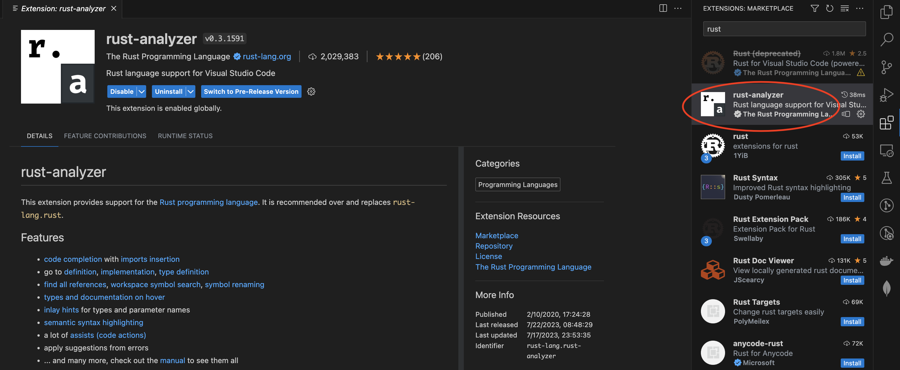
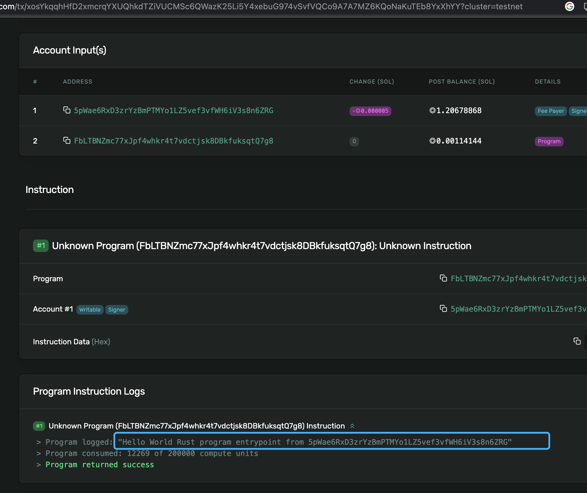

# 使用VS Code开发合约

在前面的基础中，已经安装好了rust和solana cli。首先确定rust版本:

    rustc --version
    rustc 1.70.0 (90c541806 2023-05-31)

如果没有安装，可以通过：

    curl --proto '=https' --tlsv1.2 -sSf https://sh.rustup.rs | sh

    Current installation options:

    default host triple: x86_64-apple-darwin
        default toolchain: stable (default)
                profile: default
    modify PATH variable: yes

    1) Proceed with installation (default)
    2) Customize installation
    3) Cancel installation

    直接Enter采用默认方式

    Rust is installed now. Great!

    To get started you may need to restart your current shell.
    This would reload your PATH environment variable to include
    Cargo's bin directory ($HOME/.cargo/bin).

    To configure your current shell, run:
    source "$HOME/.cargo/env"

这里执行下环境导入

    source "$HOME/.cargo/env"

在此确定下solana的版本：

    solana --version
    solana-cli 1.16.4 (src:4ce8fe76; feat:2891131721, client:SolanaLabs)

如果这里的cli是1.14.x 为当前的主网版本，我们的操作都是在测试环境，所以这里我们切换要切换到测试
环境的1.16版本:

    solana-install init 1.16.4

## 安装VS Code
打开[VS Code](https://code.visualstudio.com/)的页面，根据自己的系统选择下载对应的版本。
要先安装好rust，然后再安装VC Code 的插件。VS Code安装好后，打开VS Code，然后再插件的地方
安装rust-analyzer：

## 创建工程

在自己的工作目录下，用cargo创建一个工程：

    cargo new  --lib helloworld

然后进入到helloworld目录下，添加solana SDK的依赖：

    cargo add solana-program
    Updating `tuna` index
    Adding solana-program v1.16.5 to dependencies.

## 构建与发布
在 src/lib.rs文件中，填入如下合约代码：

    use solana_program::{
        account_info::{AccountInfo, next_account_info},
        entrypoint,
        entrypoint::ProgramResult,
        pubkey::Pubkey,
        msg,
    };

    // Declare and export the program's entrypoint
    entrypoint!(process_instruction);

    // Program entrypoint's implementation
    pub fn process_instruction(
        _program_id: &Pubkey, // Public key of the account the hello world program was loaded into
        accounts: &[AccountInfo], // The account to say hello to
        _instruction_data: &[u8], // Ignored, all helloworld instructions are hellos
    ) -> ProgramResult {

        // Iterating accounts is safer than indexing
        let accounts_iter = &mut accounts.iter();

        // Get the account to say hello to
        let account = next_account_info(accounts_iter)?;
                
        msg!("Hello World Rust program entrypoint from {}", account.key);

        Ok(())
    }

并给Cargo.toml增加：

    [features]
    no-entrypoint = []

    [lib]
    crate-type = ["cdylib", "lib"]

然后执行：

    cargo build-sbf
    Finished release [optimized] target(s) in 0.23s

表示运行成功。这个时候我们可以用solana cli来进行发布：
    
    solana program deploy target/deploy/helloworld.so 
    Program Id: FbLTBNZmc77xJpf4whkr4t7vdctjsk8DBkfuksqtQ7g8

## Rust客户端测试

我们在新建一个cli的bin工程：

    cargo new --bin cli
    Created binary (application) `cli` package

然后再main.rs里面添加：

    use std::str::FromStr;

    use solana_sdk::signature::Signer;
    use solana_rpc_client::rpc_client;
    use solana_sdk::signer::keypair;
    use solana_sdk::transaction;
    use solana_program::instruction;
    use solana_program::pubkey;

    const RPC_ADDR: &str = "https://api.devnet.solana.com";

    fn main() {
        let helloworld = pubkey::Pubkey::from_str("FbLTBNZmc77xJpf4whkr4t7vdctjsk8DBkfuksqtQ7g8").unwrap();
        
        let me = keypair::Keypair::from_base58_string("VtqQ...xs8");
        println!("me is {}", me.pubkey());

        let client = rpc_client::RpcClient::new(RPC_ADDR);

        let account_metas = vec![
            instruction::AccountMeta::new(me.pubkey(), true),
        ];

        let instruction = instruction::Instruction::new_with_bytes(
            helloworld,
            "hello".as_bytes(),
            account_metas,
        );
        let ixs = vec![instruction];

        let latest_blockhash = client.get_latest_blockhash().unwrap();
        let sig = client.send_and_confirm_transaction(&transaction::Transaction::new_signed_with_payer(
            &ixs,
            Some(&me.pubkey()),
            &[&me],
            latest_blockhash,
        )).unwrap();

        println!("tx:{}", sig);
    }

执行后可以得到：

    cargo run
    Compiling cli v0.1.0 (/Users/cz/repos/github.com/Gametaverse/Solana-Asia-Summer-2023/s101/Solana-Program-Part2/demo/helloworld/cli)
        Finished dev [unoptimized + debuginfo] target(s) in 6.13s
        Running `target/debug/cli`
    me is 5pWae6RxD3zrYzBmPTMYo1LZ5vef3vfWH6iV3s8n6ZRG
    tx:xosYkqqhHfD2xmcrqYXUQhkdTZiVUCMSc6QWazK25Li5Y4xebuG974vSvfVQCo9A7A7MZ6KQoNaKuTEb8YxXhYY

通过查看浏览器：

可以看到跟之前的Playgroud能够得到一样的效果。

