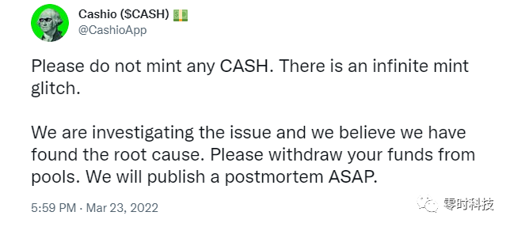

# Cashio 攻击事件分析

Cashio是一个去中心化的稳定币平台，完全由计息的Saber美元流动性提供者代币支持。允许用户做两件事：一是通过存入相应价值的稳定对 LP 代币作为抵押品，打印与美元挂钩的稳定币 - $CASH；二是燃烧$CASH 以赎回基础 LP 代币。

Cashio 提供了一种无需信任、去中心化的稳定币，由于通过 Sunny、Sabre 和 COW 上的 Tribeca Protocol Gauges 战略性地针对 CASH LP 农场的奖励代币激励措施，提高了 CASH LP 对的收益。

Cashio 应用程序提供了一个简单的界面来增加稳定币对的收益：

* 将稳定的货币流动性存入 Sabre 以换取 LP 代币。
* 将 LP 代币存入 Cashio 以打印 $CASH
* 将 $CASH 与其他稳定币存入 Sabre 以获得 $CASH LP 代币

在北京时间2022年3月23日，Cashio 称遭到黑客攻击，合约存在铸造故障，声明用户不要铸造任何资金，并督促用户提取池中的资产。



## 攻击分析

攻击交易为[4fgL8D6QXKH1q3Gt9GPzeRDpTgq4cE5hxf1hNDUWrJVUe4qDJ1xmUZE7KJWDANT99jD8UvwNeBb1imvujz3Pz2K5](https://solscan.io/tx/4fgL8D6QXKH1q3Gt9GPzeRDpTgq4cE5hxf1hNDUWrJVUe4qDJ1xmUZE7KJWDANT99jD8UvwNeBb1imvujz3Pz2K5)


攻击者的基本逻辑是

S1: 铸造Token，作为LP token
S2: 用这个LP Token去抵押得到$CASH
S3: 将$CASH套现为$USDT/$USDC

这里的基本逻辑就是用了一个fack的LP Token，可以正常兑换出来$CASH。

攻击者调用 [BRRRot6ig147TBU6EGp7TMesmQrwu729CbG6qu2ZUHWm]()的 "2efcde74f717f00300008d49fd1a0700" 指令的时候，用 [GCnK63zpqfGwpmikGBWRSMJLGLW8dsW97N4VAXKaUSSC]()充当了LP，触发Brr 在1.3里面Mint了
2000000000000000 个[CASHVDm2wsJXfhj6VWxb7GiMdoLc17Du7paH4bNr5woT]()给科学家。

## 问题原因
通过查看出问题的合约[BRRRot6ig147TBU6EGp7TMesmQrwu729CbG6qu2ZUHWm](https://github.com/cashioapp/cashio/tree/a51c3c59d544a5763b64abb4a8d82c49b0abd6d0/programs/brrr)

的代码[print_cash.rs](https://github.com/cashioapp/cashio/blob/a51c3c59d544a5763b64abb4a8d82c49b0abd6d0/programs/brrr/src/actions/print_cash.rs)

```
impl<'info> Validate<'info> for PrintCash<'info> {
    fn validate(&self) -> Result<()> {
        self.common.validate()?;
        assert_keys_eq!(self.depositor, self.depositor_source.owner);
        assert_keys_eq!(self.depositor_source.mint, self.common.collateral.mint);
        assert_keys_eq!(self.mint_destination.mint, self.common.crate_token.mint);
        assert_keys_eq!(self.issue_authority, ISSUE_AUTHORITY_ADDRESS);
        Ok(())
    }
}
```

这里没有检查时没有对arrow account 的 mint 字段进行校验。从而使得上面科学家的逻辑可以执行。